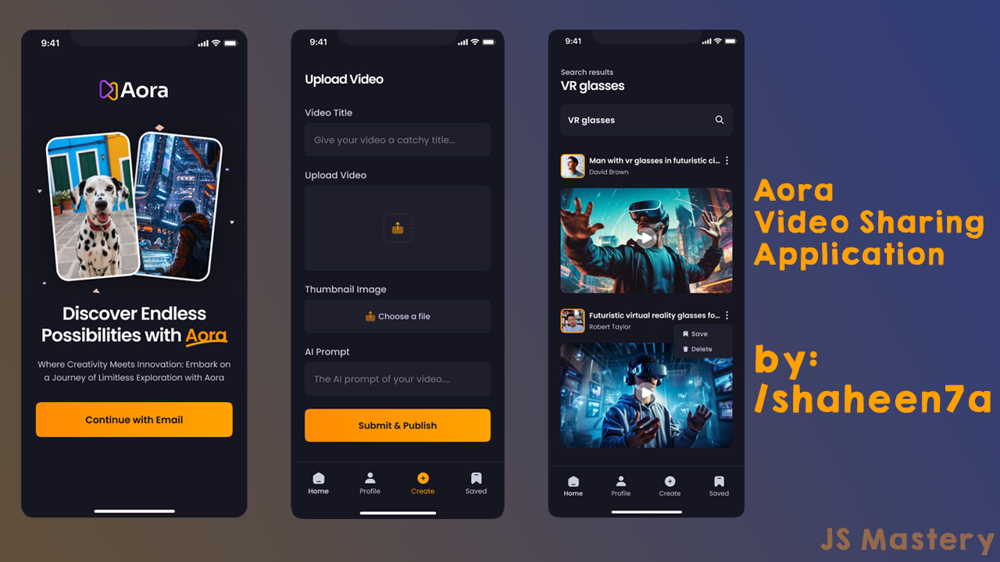

# Aora

  

    
    
    
  

## Introduction 🤖🤖

This app is built with React Native to deliver seamless user experiences. It incorporates captivating animations using Animatable and leverages the robust backend systems of Appwrite. The app aims to showcase impressive design and functionality, enabling the effortless sharing of AI-generated videos within the community.

## Tech Stack ⚙️⚙️

- React Native
- Expo
- Nativewind
- Animatable
- Appwrite

## Features 🔋🔋

- **Onboarding Screen**: Engaging graphics and clear instructions welcome users to the app.
- **Robust Authentication & Authorization System**: Secure email login safeguards user accounts.
- **Dynamic Home Screen with Animated Flat List**: Smoothly animated flat list showcases the latest videos for seamless browsing.
- **Pull-to-Refresh Functionality**: Users can refresh content with a simple pull gesture for up-to-date information.
- **Full-Text Search Capability**: Efficiently search through videos with real-time suggestions and instant results.
- **Tab Navigation**: Navigate between sections like Home, Search, and Profile with ease using tab navigation.
- **Post Creation Screen for Uploading Media**: Upload video and image posts directly from the app with integrated media selection.
- **Profile Screen with Detailed Insights**: View account details and activity, including uploaded videos and follower count, for a personalized experience.
- **Responsiveness**: Smooth performance and adaptability across various devices and screen sizes for a consistent user experience.
- **Animations**: Dynamic animations using the Animatable library to enhance user interaction and engagement throughout the app's UI.

Additional features include a well-structured code architecture and reusable components to ensure maintainability and scalability.
